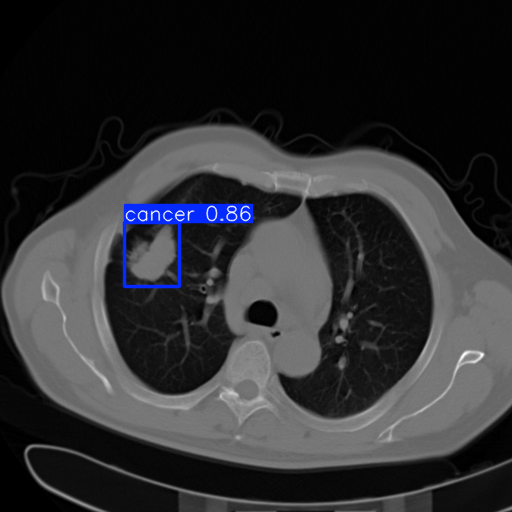

# Lung Cancer Detector

This repository contains a serverless application to detect tumors in CT/PET scans of lungs. It also contains
the code used to train the YOLOv5 model which performs inference on the images.

The dataset used for training and validation comes from the Cancer Imaging Archive:
[Lung Cancer Dataset](https://wiki.cancerimagingarchive.net/pages/viewpage.action?pageId=70224216)

Some python code for visualization and data preparation can also be found at the above link.




## Modal FastAPI Deployment

In `app/`, there is code which creates and deploys a serverless FastAPI application using Modal. The model weights
for the trained YOLOv5 model are stored in a persistent Modal volume. The FastAPI application has a simple `/predict` endpoint which allows a user to upload a `png` of a lung CT/PET scan and it will return an annotated `png`
of the same image with any detected tumors highlighted with prediction probabilities. 

Since the application is serverless, the first request to the `/predict` endpoint will take longer, since Modal will 
start up a container where the FastAPI application will run. Subsequent calls should be faster, with all the latency coming from model inference. 

An API Key is required to use the service. Contact Raamis Hussain (owner of this repo) to get the API Key. More details on the Modal deployment can be found in the README in `/app`


## Model Training

Below are details on how the model was trained and how to reproduce the results.

### Data Preparation

For data preparation, create a virtual environment and install the requirements in the `data_prep` directory. 

Run `compile_annotated_images.py` with the proper paths to the downloaded `DICOM` files and `xml` annotation files from the Cancer Imaging Archive.

This script will convert the DICOM images into PNGs and then save them in a separate directory along with the associated annotations for each image.

Next we need to create training and validation directories in the YOLO format. Use the notebook `train_test_split.ipynb` to create these directories.

This notebook will create a train/test split by patient, and then sample random images from each patient but taken at different time (different stages of lung cancer). The end of the notebook checks to make sure there are no duplicated patients between the training and validation directories, and that there are no duplicated images used in training.

### Training the model

To run reproduce the model in this repo, you must clone the YOLOv5 repository:
[YOLOv5 Repo](https://github.com/ultralytics/yolov5)

Install the necessary requirements.

The data directory structure should look like the following:

```
- data
    - custom.yaml
    - images
        - train
        - val
    - labels
        - train
        - val
```

Create a `custom.yaml` file for your data set which should be in the parent directory of the data (next to the image and label directory). The contents of the `yaml` file should be:

```
names:
- cancer
nc: 1
train: /path/to/training/images/
val: /path/to/validation/images/
```

Now you can train the model by running the following command:

```
python /path/to/yolov5/train.py --img 512 --epochs 100 --data /path/to/custom.yaml --weights yolov5s.pt
```

